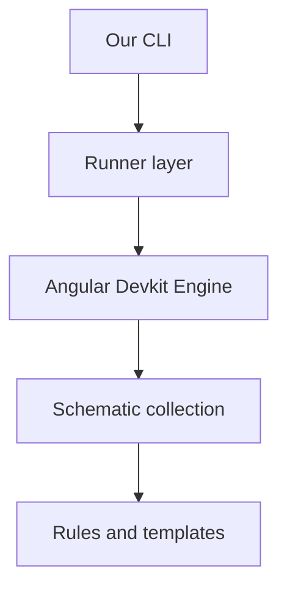

# gb-schematics

## Architecture

- [Devkit Runner Architecture Note](docs/devkit-runner-architecture.md)

| Package                                          |                                       |
| ------------------------------------------------ | ------------------------------------- |
| [**cli**](packages/cli//README.md)               | Schematics runner `gb-schematics-cli` |
| [**schematics**](packages/schematics//README.md) | Some of my favorite schematics        |

# Development

> pnpx tsx tools/make-schemas

see

- [Angular Schematics](https://github.com/angular/angular-cli/tree/main/packages/schematics/angular)
- [Schematics README](https://github.com/angular/angular-cli/blob/main/packages/angular_devkit/schematics/README.md)
- [Angular Blog](https://blog.angular.io/schematics-an-introduction-dc1dfbc2a2b2)
