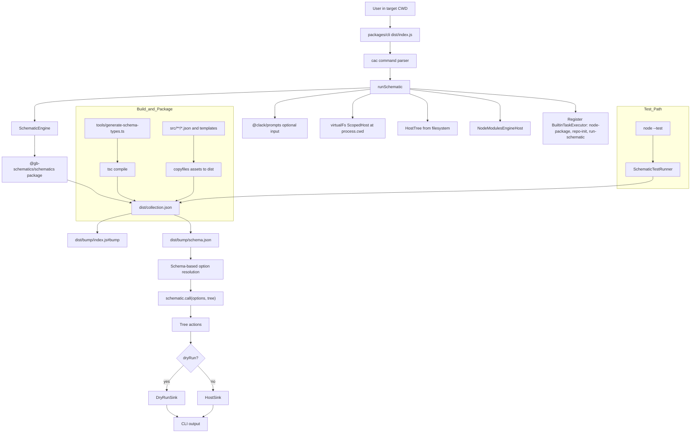

# Devkit Runner Architecture Note

This repository intentionally treats Angular Devkit/Schematics as the core engine and keeps local CLI behavior as a thin wrapper.

The purpose of this note is handoff continuity for future contributors and agents.

## Mermaid Rendering Note (VS Code)

When documenting Devkit runner flows with Mermaid in VS Code, prefer quoted labels:

- Use `A["label"]` instead of `A[label]`.
- Avoid special characters in labels when possible (`@`, `#`, unescaped braces).

This avoids the common `[object Object]` rendering glitch in some Mermaid integrations.

## Architecture Diagram

## Core Position

- Devkit is the source of truth for schematic execution semantics.
- `packages/cli` is a runner and UX layer.
- `packages/schematics` is the collection and rule implementation layer.
- We prefer compatibility with Devkit conventions over custom framework behavior.

## Package Responsibilities

### `packages/schematics`

- Owns schematic rules, templates, and schema metadata.
- Must publish a resolvable `dist/collection.json`.
- Build output must include runtime JSON/template assets (not only compiled JS).
- Rule code must be ESM-safe (`.js` extensions for internal runtime imports).

### `packages/cli`

- Owns command parsing, prompts, and runner ergonomics.
- Resolves a collection and executes schematics against the current working directory.
- Uses Devkit engine APIs directly, with minimal behavior added.

## Runtime Contracts We Rely On

1. Collection discovery is package-based (for example `@gb-schematics/schematics`).
2. Collection metadata path is `schematics` field in package manifest, currently `./dist/collection.json`.
3. Schematic factories referenced in `collection.json` must resolve to built JS at runtime.
4. Runner must initialize from a host-backed tree (`HostTree`) when schematics need to read existing cwd files.
5. If schematics enqueue tasks (for example `NodePackageInstallTask`), built-in task executors must be registered in the custom runner.

## Testing Strategy

We run schematic tests with `SchematicTestRunner` against **built outputs** for reliability:

- Specs point to `dist/collection.json`.
- Test flow builds schematics package first, compiles spec files, then runs `node --test` against `dist/**/*_spec.js`.
- This avoids mismatch between TS source and Devkit factory resolution behavior.

Rationale: source-level execution can work in narrow setups, but dist-backed tests are the stable default with Devkit internals.

## Build/Asset Expectations

Schematics package build must perform all of the following:

1. Generate schema TypeScript artifacts from `schema.json`.
2. Compile TS sources to `dist`.
3. Copy JSON schema/collection assets and template files to `dist`.

If any of these are missing, CLI execution can fail even when TypeScript compilation passes.

## CLI Behavior Notes

- Unknown schematic-specific flags are allowed to pass through CLI parsing.
- Default collection should match this repo scope (`@gb-schematics/schematics`).
- Running from cwd means the target project is whichever directory the command is executed in.
- `bump` requires a valid `version` field in target `package.json`.

## Practical Troubleshooting

If CLI cannot run a schematic, check in this order:

1. `packages/schematics/dist/collection.json` exists.
2. Factory path in collection points to existing built JS.
3. ESM imports in built schematic JS are explicit and resolvable.
4. Runtime deps used by schematic code are declared in `packages/schematics/package.json`.
5. Runner registers task executors required by queued tasks.

## Design Guideline For Future Work

When adding features, prefer:

- Thin wrappers around Devkit primitives.
- Explicit, testable contracts between collection, build output, and runner.
- Dist-backed verification for integration tests.

Avoid:

- Reimplementing Devkit behavior in the CLI unless there is a clear UX requirement.
- Source-only test setups that bypass runtime resolution contracts.

## Handoff Checklist

Before merging CLI/schematic integration changes:

1. Build schematics package and verify `dist/collection.json` exists.
2. Run at least one end-to-end CLI command against a temporary project with a real `package.json` version.
3. Run schematics tests (node:test) using current package scripts.
4. Confirm no scope mismatches between package names and default collection values.
