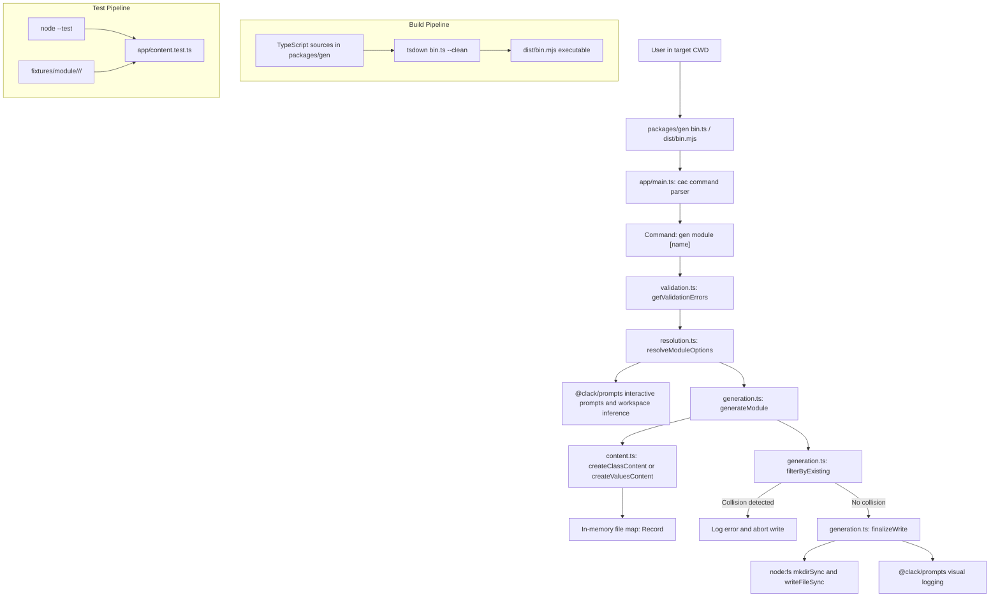
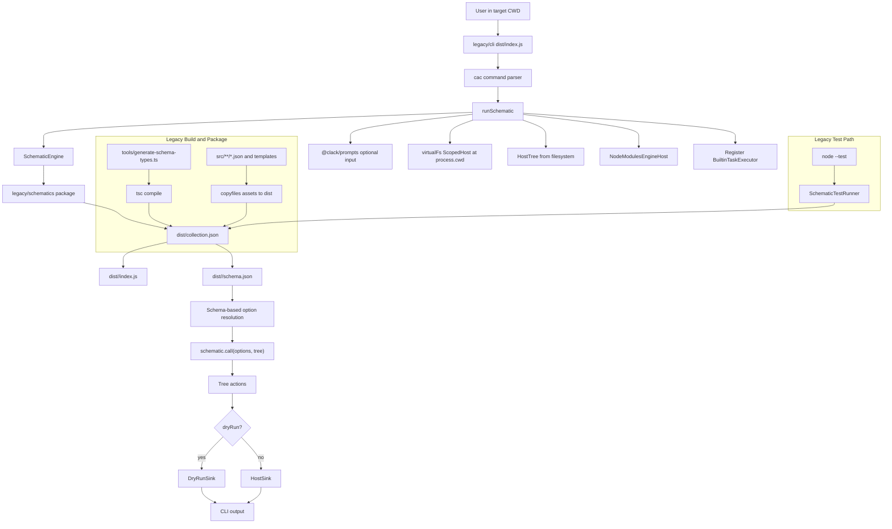

# Scaffolding & Devkit Runner Architecture Note

> **Status Notice (Version 7.0.0):**
> This repository transitioned from the Angular DevKit engine to a lightweight, zero-DevKit direct scaffolding architecture (`@gb-schematics/gen`).
> The original Angular DevKit runner (`@gb-schematics/cli`) and schematics collection (`@gb-schematics/schematics`) are archived in `legacy/`.
> This document details the active Version 7 architecture while preserving legacy DevKit runner architecture details for historical context and handoff continuity.

---

## Mermaid Rendering Note (VS Code)

When documenting runner flows with Mermaid in VS Code, prefer quoted labels:

- Use `A["label"]` instead of `A[label]`.
- Avoid special characters in labels when possible (`@`, `#`, unescaped braces).

This avoids the common `[object Object]` rendering glitch in some Mermaid integrations.

---

## Architecture Diagrams

### 1. Active Version 7 Architecture (`@gb-schematics/gen`)


```mermaid
flowchart TD
	U["User in target CWD"] --> BIN["packages/gen bin.ts / dist/bin.mjs"]
	BIN --> MAIN["app/main.ts: cac command parser"]
	MAIN --> CMD["Command: gen module [name]"]

	CMD --> VAL["validation.ts: getValidationErrors"]
	VAL --> RES["resolution.ts: resolveModuleOptions"]
	RES --> PROMPT["@clack/prompts interactive prompts and workspace inference"]

	RES --> GEN["generation.ts: generateModule"]
	GEN --> CONT["content.ts: createClassContent or createValuesContent"]
	CONT --> MAP["In-memory file map: Record<path, content>"]

	GEN --> CHECK["generation.ts: filterByExisting"]
	CHECK -->|Collision detected| ABORT["Log error and abort write"]
	CHECK -->|No collision| WRITE["generation.ts: finalizeWrite"]
	WRITE --> FS["node:fs mkdirSync and writeFileSync"]
	WRITE --> LOG["@clack/prompts visual logging"]

	subgraph Build_Pipeline["Build Pipeline"]
		SRC["TypeScript sources in packages/gen"]
		TSDOWN["tsdown bin.ts --clean"]
		DIST["dist/bin.mjs executable"]
		SRC --> TSDOWN
		TSDOWN --> DIST
	end

	subgraph Test_Pipeline["Test Pipeline"]
		NODETEST["node --test"]
		SUITE["app/content.test.ts"]
		FIXTURES["fixtures/module/<language>/<kind>/<testRunner>"]
		NODETEST --> SUITE
		FIXTURES --> SUITE
	end
```

### 2. Legacy DevKit Architecture (Archived in `legacy/`)


```mermaid
flowchart TD
	U["User in target CWD"] --> CLI["legacy/cli dist/index.js"]
	CLI --> CAC["cac command parser"]
	CAC --> RUN["runSchematic"]

	RUN --> CLACK["@clack/prompts optional input"]
	RUN --> HOST["virtualFs ScopedHost at process.cwd"]
	RUN --> TREE["HostTree from filesystem"]
	RUN --> ENGHOST["NodeModulesEngineHost"]
	RUN --> ENG["SchematicEngine"]
	RUN --> TASKS["Register BuiltinTaskExecutor"]

	ENG --> COLL["legacy/schematics package"]
	COLL --> DISTCOLL["dist/collection.json"]
	DISTCOLL --> FACTORY["dist/<schematic>/index.js"]
	DISTCOLL --> SCHEMA["dist/<schematic>/schema.json"]

	SCHEMA --> OPTS["Schema-based option resolution"]
	OPTS --> CALL["schematic.call(options, tree)"]
	CALL --> RESULT["Tree actions"]

	RESULT --> SINK{"dryRun?"}
	SINK -->|yes| DRY["DryRunSink"]
	SINK -->|no| HOSTSINK["HostSink"]
	DRY --> OUT["CLI output"]
	HOSTSINK --> OUT

	subgraph Legacy_Build["Legacy Build and Package"]
		SRCJSON["src/**/*.json and templates"]
		GENTS["tools/generate-schema-types.ts"]
		TSC["tsc compile"]
		COPY["copyfiles assets to dist"]

		GENTS --> TSC
		SRCJSON --> COPY
		TSC --> DISTCOLL
		COPY --> DISTCOLL
	end

	subgraph Legacy_Test["Legacy Test Path"]
		LTEST["node --test"]
		STRUN["SchematicTestRunner"]
		LTEST --> STRUN
		STRUN --> DISTCOLL
	end
```

---

## Architectural Evolution: Why Version 7 Removed DevKit

Version 6 and earlier relied on `@angular-devkit/schematics` as the execution engine. While powerful for complex AST transforms in the Angular ecosystem, DevKit introduced substantial complexity:

- **Heavy Dependency Graph:** DevKit packages brought significant runtime and build overhead, including RxJS version compatibility challenges across monorepo packages.
- **Complex Abstractions:** Virtual file system hosts (`virtualFs.ScopedHost`, `HostTree`), sinks (`HostSink`, `DryRunSink`), and engine hosts (`NodeModulesEngineHost`) created layers of indirection for what is fundamentally template and file creation.
- **Multi-Stage Build Burden:** Schematics required generating TypeScript typings from JSON schemas (`tools/generate-schema-types.ts`), compiling TypeScript with `tsc`, and running `copyfiles` to transport `collection.json` and raw template files to `dist/`.
- **Runtime Resolution Fragility:** Schematics factories were resolved dynamically from string paths in `collection.json`, leading to runtime path resolution issues and ESM compatibility hurdles.

**Version 7 Decision:**
Scaffolding has been simplified for developers and AI agents. Code generation in `@gb-schematics/gen` uses plain Node.js built-ins (`node:fs`, `node:path`), `@clack/prompts` for interactive UX, `cac` for command routing, and `tsdown` for fast single-step builds.

---

## Core Position

- **Direct Execution:** Code generation relies directly on pure TypeScript generator functions returning in-memory file representations.
- **Safety by Default:** Pre-flight collision checks (`filterByExisting`) ensure no files are overwritten or partially generated if a collision occurs.
- **Agent and Developer Ergonomics:** Simple CLI commands (`gen module <name> [options]`) with interactive prompts fallback when options are missing.
- **Minimal Tooling:** Fast builds powered by `tsdown`, tests executed with native `node --test`, and formatting/linting via ESLint and Prettier.
- **Legacy Preservation:** The DevKit runner and collections are maintained under `legacy/` for reference and backward compatibility.

---

## Package Responsibilities

### `packages/gen` (`@gb-schematics/gen`) — Active

- **`bin.ts`:** Executable entrypoint (`#!/usr/bin/env node`), handles top-level execution and error exit codes.
- **`app/main.ts`:** Sets up `cac("gen")`, configures `module` command options, and routes commands.
- **`app/types.ts`:** Domain types (`ModuleOptions`, `ModuleKind`, `Language`, `TestRunner`).
- **`app/validation.ts`:** Validates option inputs against supported option sets (`kindOptions`, `languageOptions`, `testRunnerOptions`).
- **`app/resolution.ts`:** Resolves missing CLI options interactively via `@clack/prompts` (`text`, `select`) or workspace inference.
- **`app/content.ts`:** Pure generator functions (`createClassContent`, `createValuesContent`) creating source and test file contents.
- **`app/generation.ts`:** Orchestrates file writing: verifies destination, detects existing files, creates directories (`mkdirSync`), and writes files (`writeFileSync`).
- **`app/logger.ts`:** Defines `LoggingService` contract matching `@clack/prompts.log`.
- **`fixtures/`:** Golden test fixtures covering combinations of `language` (ts/js), `kind` (class/values), and `testRunner` (vitest/node/none).

### `legacy/cli` (`@gb-schematics/cli`) — Archived

- Archived Version 6 CLI runner.
- Wrapped Angular DevKit engine using `cac`, `@clack/prompts`, and RxJS streams.

### `legacy/schematics` (`@gb-schematics/schematics`) — Archived

- Archived collection of schematics: `bump`, `module`, `sveltekit-component`, `sveltekit-route`.
- Contains `collection.json`, JSON schemas, and rule template trees.

---

## Runtime Contracts

### Version 7 (`gen`) Contracts

1. **CLI Entrypoint:** The published binary `gen` maps to `./dist/bin.mjs` (target: Node.js >= 24).
2. **Atomic Verification:** Generator generates all paths in-memory first; if any target file exists on disk, generation immediately halts with errors and writes nothing.
3. **Interactive Resolution:** When executed without required arguments in an interactive shell, `@clack/prompts` prompts for `name`, `language`, `kind`, `testRunner`, and `directory`.
4. **Deterministic Output:** Content generators (`createClassContent`, `createValuesContent`) are deterministic pure functions mapping `ModuleOptions` to `Record<string, string>`.

### Legacy DevKit Contracts (v6 Context)

1. Collection discovery was package-based (`@gb-schematics/schematics`).
2. Collection metadata path was declared in package manifest `schematics` field (`./dist/collection.json`).
3. Schematic factories referenced in `collection.json` resolved to built JS at runtime.
4. Schematics required `HostTree` and `SchematicEngine` to inspect and modify target directories.

---

## Testing Strategy

### Version 7 Testing (`node --test`)

Tests run with Node's native test runner against source files and fixtures:

- **Fixture Tests (`packages/gen/app/content.test.ts`):** Iterates over permutations of `language` (`ts`, `js`), `kind` (`values`, `class`), and `testRunner` (`vitest`, `none`, `node`), asserting generated code and specs match golden files in `packages/gen/fixtures/module/`.
- **Unit Tests:** Direct assertions on `createValuesContent` and `createClassContent` output structures.
- **Execution:** Run via `pnpm test` (root) or `node --test` within `packages/gen`.

### Legacy Testing Strategy

- Legacy schematics used `SchematicTestRunner` against built outputs (`dist/collection.json`).
- Tests required compilation to `dist` before running `node --test` on `dist/**/*_spec.js`.

---

## Build Pipeline

### Version 7 Build

- **Single-step Bundling:** `tsdown bin.ts --clean` bundles `packages/gen/bin.ts` and its application code into an executable ESM artifact at `packages/gen/dist/bin.mjs`.
- **No Asset Copying:** Templates are defined in TypeScript source code (`content.ts`), eliminating the need for `copyfiles` or schema generation build steps.
- **Root Script:** `pnpm build` triggers `pnpm -r --if-present build`.

### Legacy Build Pipeline

- Step 1: `node ./tools/generate-schema-types.ts` generated TypeScript interfaces from `schema.json`.
- Step 2: `tsc` compiled TypeScript files to `dist`.
- Step 3: `copyfiles` copied `collection.json`, JSON schemas, and template files into `dist`.

---

## CLI Options & Usage (Version 7)

```bash
# Generate a module
gen module [name] [options]

# Or locally during development:
node packages/gen/dist/bin.mjs module [name] [options]
```

### Options

- `--directory <directory>`: Relative destination directory for the module.
- `--kind <kind>`: Module style: `class` (with methods) or `values` (functions and constants).
- `--language <language>`: Source language: `ts` or `js`.
- `--test-runner <runner>`: Test framework: `vitest`, `node`, or `none`.
- `--in-source-tests`: When using Vitest, include tests within source files rather than separate `.test` files.
- `--pascal-case-files`: Use PascalCase file naming for class modules.
- `-h, --help`: Display help and option descriptions.

---

## Practical Troubleshooting

If `gen` fails or produces unexpected results:

1. **Verify Build Artifact:** Ensure `packages/gen/dist/bin.mjs` exists by running `pnpm build`.
2. **Run Fixture Tests:** Execute `pnpm test` to verify that content generators still match expected fixtures.
3. **Check for File Collision:** If the target directory already contains `<name>.<ext>` or `<name>.test.<ext>`, the command intentionally aborts without modifying existing files.
4. **Inspect Validation Errors:** If invalid options are provided (e.g. `--kind foo`), `getValidationErrors()` logs allowed values and halts execution with exit code 1.
5. **Check Node Version:** Ensure Node.js version satisfies engine requirement (`>= 24`).

---

## Design Guidelines For Future Work

When extending the v7 scaffolding engine:

- **Keep It Light:** Avoid introducing heavy framework dependencies or AST engines unless complex in-place code transformations strictly require them.
- **Pure Content Functions:** Keep file content creation in pure functions (`Record<string, string>`) that can be tested deterministically with fixtures.
- **Maintain Collision Safety:** Always run pre-flight checks (`filterByExisting`) before performing disk writes.
- **Update Golden Fixtures:** When updating generated template content, update corresponding fixtures in `packages/gen/fixtures/` and verify with `pnpm test`.

---

## Handoff Checklist

Before merging changes to scaffolding or CLI packages:

1. Run `pnpm build` and verify `packages/gen/dist/bin.mjs` compiles cleanly.
2. Run `pnpm test` and verify all 14 fixture and unit test cases pass.
3. Run `pnpm lint` to ensure ESLint passes with zero warnings or errors.
4. Test the generated CLI binary locally:
   ```bash
   node packages/gen/dist/bin.mjs module sample --language ts --kind class --test-runner node --directory tmp/test-run
   ```
5. Confirm no regressions or broken imports across monorepo packages.
