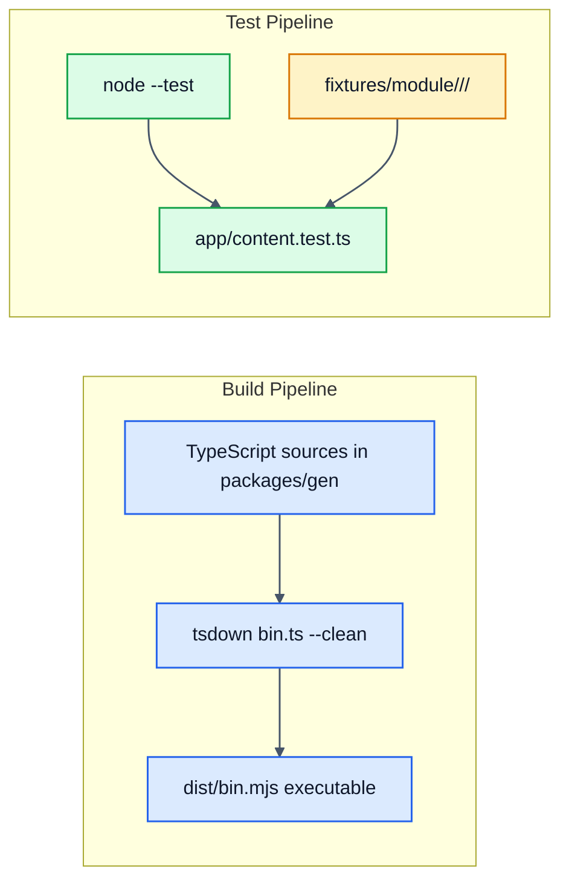

# @gb-schematics/gen

[](https://badge.fury.io/js/@gb-schematics%2Fgen)
[](https://github.com/GaryB432/gb-schematics/actions/workflows/ci.yml)

Scaffold a quick module (a `class` or plain values) for idea capture

> [!TIP]
> Capture a flash of insight with `gen module kitchen-sink` to scaffold a module and test to build upon. No need to explain your setup.

## Usage

```bash
# Generate a module
gen module [name] [options]

# Or locally during development:
node packages/gen/bin.ts module [name] [options]

# For clack enjoyers
ALL_PROMPTS=true node packages/gen/bin.ts module [name] [options]
```

### Arguments

`<name>` : Name for the generated module (e.g., `greeter`). **Required.**

### Options

**`-d, --directory <directory>`** : The directory to in which to create the module.

**`-k, --kind <kind>`** : Kind of module. Options: `class` (with methods), `values` (export const or function expressions). Default: `values`.

**`--test-runner <runner>`** : Test runner to use for unit tests (vite or node or none) Options: `vite`, `node` or `none`.

**`--in-source-tests`** : When using Vitest, separate spec files will not be generated and instead will be included within the source files.

**`--pascal-case-files`** : Use pascal case file names for class module.

**`-l, --language <language>`** : Language (extension) for module. Options: `ts`, `js`. Default: `js`.

**`--dry-run`** : Bypass writing to disk.

## Issues

The sources for this package are in the main [gb-schematics](../../README.md) repo. Please file issues and pull requests against that repo.

## Pipelines


